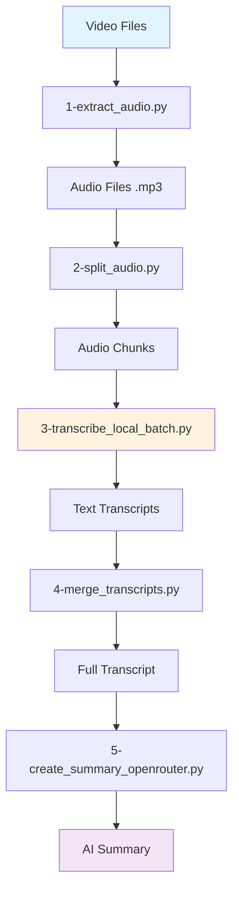

# Audio Processing & Transcription Pipeline

Automated pipeline for converting video recordings into text transcripts and AI summaries. Built this for processing meeting recordings and interview sessions.

## Features

- Extract audio from video files (webm, mp4, etc.)
- Split long audio files into chunks for better processing
- Local transcription using Whisper large-v3 model
- Merge transcripts with timestamp information  
- Generate summaries using OpenRouter API

## 📁 Project Structure

```
clean-workflow/
├── 1-extract_audio.py          # Video → Audio conversion
├── 2-split_audio.py             # Audio chunking with overlap
├── 3-transcribe_local_batch.py  # Whisper-based transcription
├── 4-merge_transcripts.py       # Transcript consolidation
├── 5-create_summary_openrouter.py # AI summary generation
├── input/                       # Input video files (.webm, .mp4, etc.)
├── audio-from-input/           # Extracted audio files (.mp3)
├── chunks/                     # Audio segments by project
│   └── [project-name]/         # Individual audio chunks
├── raw_text/                   # Transcription results
│   └── [project-name]/         # Text files with timestamps
│       ├── [chunk]_part001.txt
│       ├── [chunk]_part002.txt
│       └── _full_transcript.txt
└── summaries/                  # Final AI summaries
    └── [project-name]/
        └── _summary.txt
```

## Tech Stack

- **FFmpeg** for audio processing
- **Whisper Large-v3** via transformers library
- **PyTorch** with CUDA acceleration
- **OpenRouter API** for summary generation
- **Python 3.8+**

## Setup

### Requirements
- Python 3.8+
- FFmpeg (for audio processing)
- OpenRouter API key
- CUDA GPU (optional, speeds up transcription)

### Installation
```bash
# Install dependencies
pip install -r clean-workflow/requirements.txt

# For CUDA support (recommended)
pip install torch torchvision torchaudio --index-url https://download.pytorch.org/whl/cu118

# Install FFmpeg
# Ubuntu: sudo apt install ffmpeg
# macOS: brew install ffmpeg
# Windows: Download from ffmpeg.org
```

### Configuration
Copy `.env.example` to `.env` and add your OpenRouter API key:
```bash
cp clean-workflow/.env.example clean-workflow/.env
# Edit .env file with your API key
```

## 📋 Usage

The pipeline consists of 5 sequential steps. Each script provides an interactive menu for file selection:

### Step 1: Extract Audio
```bash
cd clean-workflow
python 1-extract_audio.py
```
Extracts high-quality MP3 audio from video files in the `input/` directory.

### Step 2: Split Audio
```bash
python 2-split_audio.py
```
Splits audio files into 10-minute chunks with 10-second overlap for seamless transcription.

### Step 3: Transcribe Audio
```bash
python 3-transcribe_local_batch.py
```
Uses local Whisper model to transcribe audio chunks with timestamp information.

### Step 4: Merge Transcripts
```bash
python 4-merge_transcripts.py
```
Combines individual transcript files into a single document with metadata.

### Step 5: Generate Summary
```bash
python 5-create_summary_openrouter.py
```
Creates a professional summary using AI, formatted with key takeaways and action items.

## 🏗️ Pipeline Architecture



## Notes

- Each script can be run independently for debugging
- Scripts detect existing outputs and ask before overwriting
- Interface is in Russian since I mainly process Russian meetings
- GPU acceleration makes transcription much faster
- File organization keeps everything structured by project name

## 📊 Example Output

The pipeline generates professional summaries like:

```markdown
### Meeting Summary: project-review-2024
#### 🔹 Key Discussion Topics:
- Q4 performance review and metrics analysis
- Resource allocation for upcoming initiatives
#### 🎯 Main Conclusions:
- Revenue targets exceeded by 15%
- Team capacity planning needs adjustment
#### ✅ Decisions Made:
- Approve budget increase for development team
- Implement new project tracking system
```

## TODO

- [ ] Single script to run entire pipeline
- [ ] Better progress indicators  
- [ ] Docker setup
- [ ] Web interface
- [ ] Support more AI models
